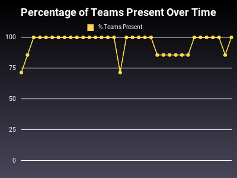

# Chef's OSS Stats

This repo aims to track stats that affect how Chef Users ("the community") can
interact with Progress' development teams and repositories.

It leverages [oss-stats](https://github.com/jaymzh/oss-stats) to track those
stats.

## Build Status

Currently, each week we run `ci_stats` and post the results in
[ci_reports](ci_reports). That tracks stats on PR, Issue, and CI health.

You can run these reports via our
[run_weekly_ci_reports.sh](run_weekly_ci_reports.sh) wrapper which loops over
all the repos and runs the script.

## Slack Meeting Stats

In addition, we use `meeting_stats` to record and report on the health of those
meetings. You can find the results of those in [Slack Status
Tracking](team_slack_reports.md). Here, however, are the trends:

 

## Pipeline visibility stats

We use `pipeline_visibility_stats.rb` to record the stats on how many checks on
public repos are private. You can see the results of those in
[pipeline_visibility_reports](pipeline_visibility_reports).

## Manual or semi-manual stats

There are a variety of miscelanious manual statistics which are gathered
manually and recorded in [Misc stats](manual_stats/misc.md)
